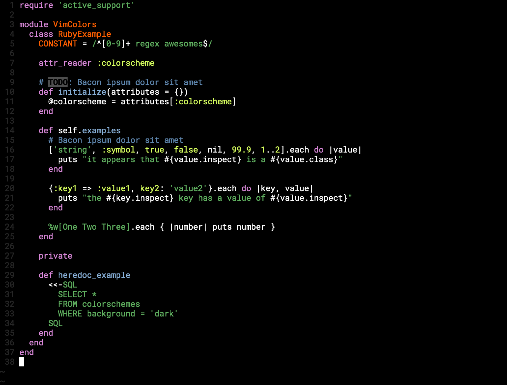

# Simple Black



## Install

#### [Plug](https://github.com/junegunn/vim-plug)

```
Plug 'lucasprag/simpleblack'
```

#### [Vundle](https://github.com/VundleVim/Vundle.vim)

```
Plugin 'lucasprag/simpleblack'
```

## Usage

Change your `.vimrc`

```
colorscheme simpledark
```

Thanks
