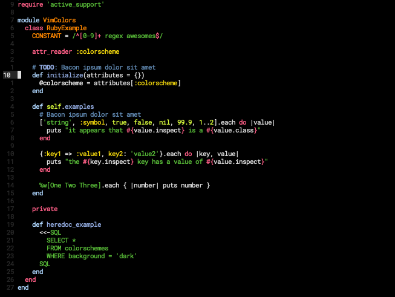

# Simple Black

A black colorscheme for (neo)vim, real black background, #000000.



## Install

Using [Plug](https://github.com/junegunn/vim-plug) and getting updates when running `:PlugUpdate`.

```
Plug 'lucasprag/simpleblack'
```

You can also set a specific version if you want to not receive updates.

```
Plug 'lucasprag/simpleblack', { 'tag': 'v0.1.0' } " latest version
```

## Features

### Ruby

Notice that you can distinguish between module, class and method ending by color.


## Usage

Change your `~/.vimrc` or `~/.config/nvim/init.vim`.

```
colorscheme simpleblack
```

## Inspiration
- [irblack](https://github.com/wesgibbs/vim-irblack)
- [SpaceCamp](https://github.com/jaredgorski/SpaceCamp)

Thanks
