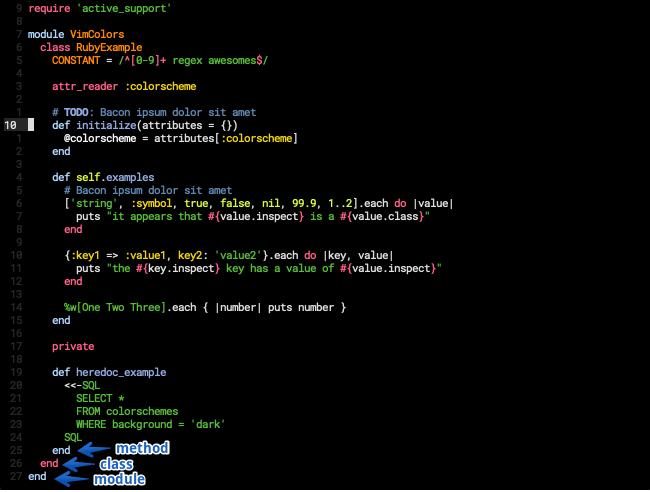

# Simple Black

A black colorscheme for (neo)vim, real black background, #000000.

Color schemes define colors for syntax groups which are defined by Vim and syntax highlighting plugins. This colorscheme should work even if you don't have the syntax highlighting plugins listed below.

Supported languages/syntaxes:
- Ruby using [vim-ruby/vim-ruby](https://github.com/vim-ruby/vim-ruby)
- JavaScript using [yuezk/vim-js](https://github.com/yuezk/vim-js)
- TypeScript using [HerringtonDarkholme/yats.vim](https://github.com/HerringtonDarkholme/yats.vim)

More on the way!


## Install

Using [Plug](https://github.com/junegunn/vim-plug) and getting updates when running `:PlugUpdate`.

```
Plug 'lucasprag/simpleblack'
```

You can also set a specific version if you want to not receive updates.

```
Plug 'lucasprag/simpleblack', { 'tag': 'v0.3.0' } " latest version
```

## Screenshots

#### Ruby

Notice that you can distinguish between module, class and method endings by color.



#### JavaScript


#### TypeScript


## Usage

Change your `~/.vimrc` or `~/.config/nvim/init.vim`.

```
colorscheme simpleblack
```

## Inspiration
- [irblack](https://github.com/wesgibbs/vim-irblack)
- [SpaceCamp](https://github.com/jaredgorski/SpaceCamp)

Thanks
